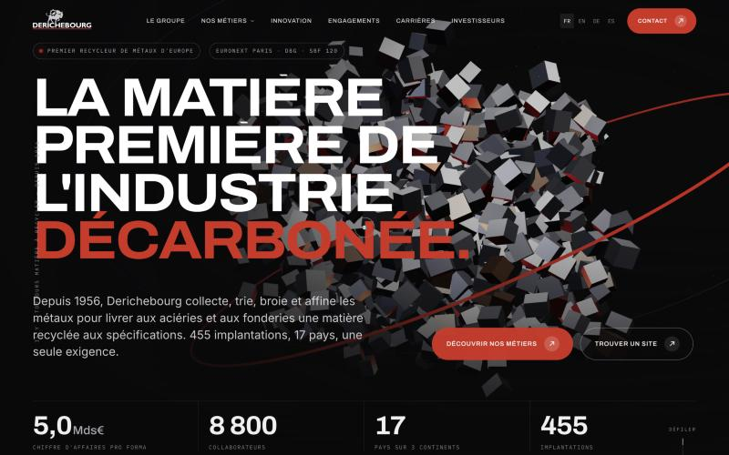

# Derichebourg — maquette de refonte du site

Proposition de refonte du site du groupe Derichebourg, premier recycleur de métaux d'Europe. Site statique de huit pages : accueil, groupe, métiers, innovation, engagements, carrières, investisseurs, contact.



## Lancer la maquette

Le site charge ses données de carte en `fetch`, il faut donc un petit serveur local :

```bash
node tools/serve.js 8791
```

Puis ouvrir http://localhost:8791/.

## Stack

HTML, CSS et JavaScript sans framework. GSAP et ScrollTrigger pour les animations, Lenis pour le défilement, Three.js pour la 3D (hero et globe), d3-geo et TopoJSON pour les cartes.

Le détail des pages, des sources photo et des données à valider est dans [NOTES-MAQUETTE.md](NOTES-MAQUETTE.md).
